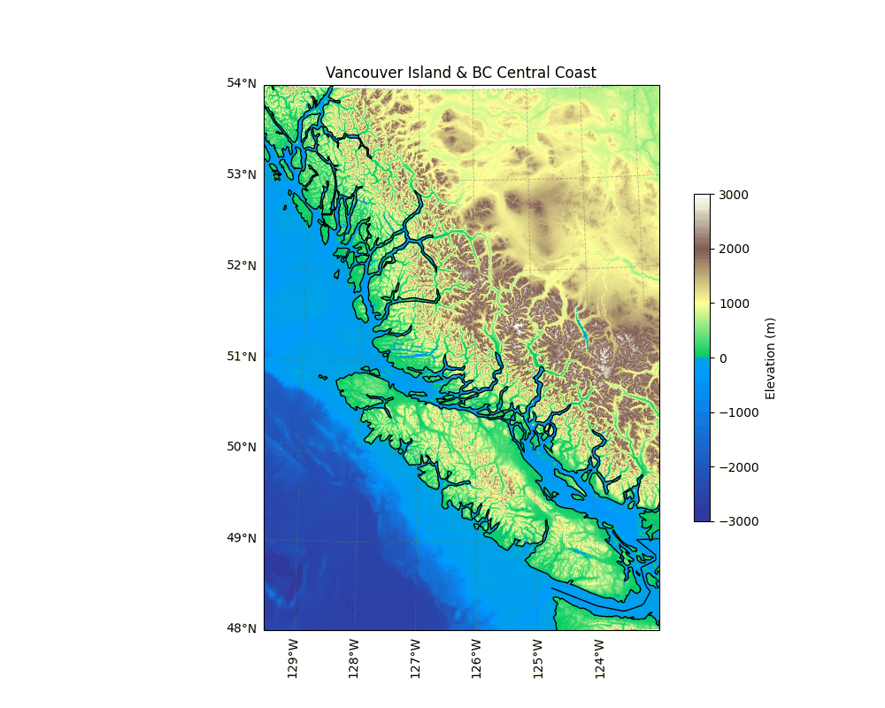

# BC_coast_animation.py

`BC_coast_animation.py` generates a map of Vancouver Island and the BC coast, visualizing both topography and bathymetry using high-resolution bathymetry and topography data. The script uses Cartopy and Matplotlib to plot the region.

For gits and shiggles the script includes an animated expanding circle, simulating a seismic wave propagating from a hypothetical epicenter on the west coast of Vancouver Island.  The animation is saved as a GIF.

**Main features:**

- Loads and visualizes bathymetry/topography from a GeoTIFF file using rioxarray
- Plots the region with Lambert Conformal projection
- Uses `topo` colourmap from [cmocean](https://matplotlib.org/cmocean/)
- Adds coastlines, borders, and gridlines
- Animates a propagating wave modelled as a front expanding at a constante rate
- Saves the animation as a GIF

**Dependencies:**

- matplotlib
- cmocean
- cartopy
- rioxarray
- xarray
- shapely
- numpy

**Usage:**

1. Create a Python virtual environment and install the project dependencies with `uv sync` [(uv installation)](https://docs.astral.sh/uv/getting-started/installation/).
2. Place a GeoTIFF bathymetry file (e.g., `gebco_2025_n54.0_s48.0_w-130.0_e-122.0.tif`) in the project directory.
3. Run the script: `uv run BC_coast_animation.py` or `python BC_coast_animation.py` with the correct Python environment activated.
